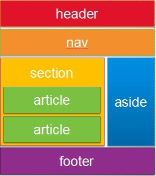

# 3. UI 레이아웃을 위한 HTML 태그


## 레이아웃을 위한 태그
- header
- section
- nav
- footer
- aside
  
### 실습코드
```html
<!DOCTYPE html>
<html>
<head>
  <meta charset="utf-8">
  <meta name="viewport" content="width=device-width">
  <title>JS Bin</title>
</head>
<body>
  <header>header</header>
  <div id="container">
    <nav><ul>
      <li>home</li>
      <li>news</li>
      <li>sports</li>
    </ul></nav>
    <aside><ul>
      <li>로그아웃</li>
      <li>오늘의 날씨</li>
      <li>운세</li>
    </ul></aside>
  </div>
  <footer>footer</footer>
</body>
</html>
```
